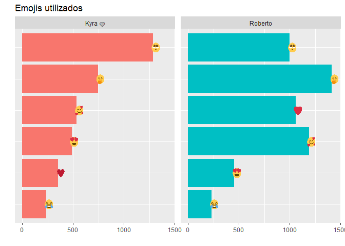
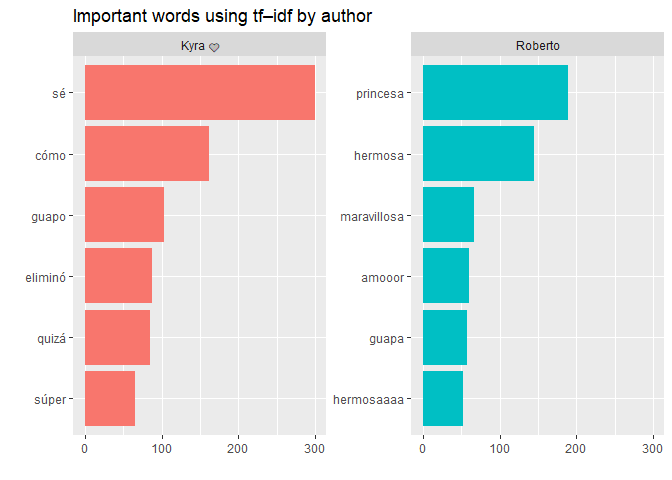
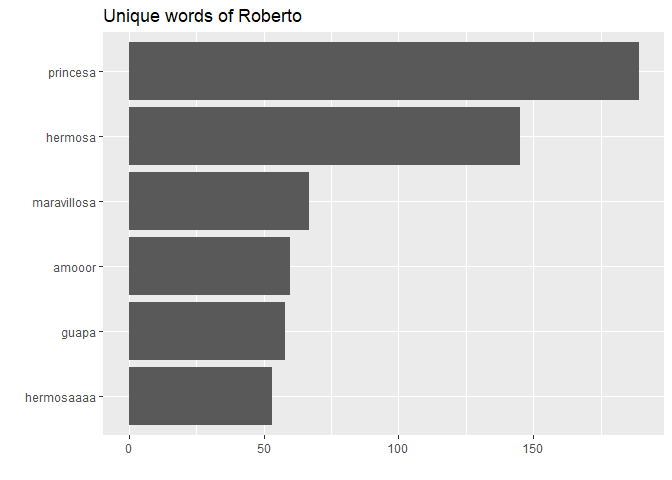
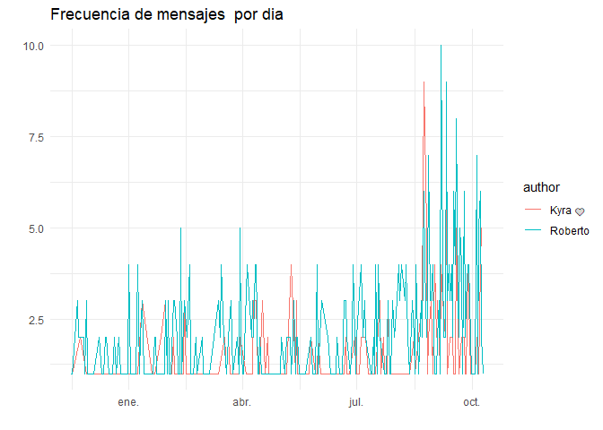
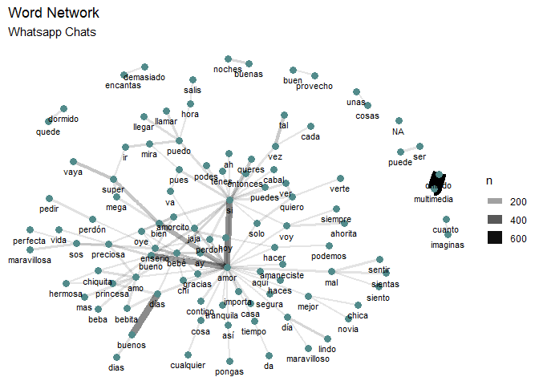

Laboratorio Análisis Whatsapp
================
Roberto Lacayo
24/10/2021

### Este laboratorio es un análisis al chat de whatsapp con mi novia, en donde nos enfocaremos directamente en los mensajes y palabras sin asignarles ningun peso el cual serviría para un análisis de sentimietos.

## Emojis

``` r
##############Emojis###############

chat %>%
  unnest(emoji) %>%
  count(author, emoji, sort = TRUE) %>%
  group_by(author) %>%
  top_n(n = 6, n) %>%
  left_join(emoji_data, by = "emoji") %>% 
  ggplot(aes(x = reorder(emoji, n), y = n, fill = author)) +
  geom_col(show.legend = FALSE) +
  ylab("") +
  xlab("") +
  coord_flip() +
  geom_image(aes(y = n + 20, image = emoji_url)) +
  facet_wrap(~author, ncol = 2, scales = "free_y") +
  ggtitle("Emojis utilizados") +
  theme(axis.text.y = element_blank(),
        axis.ticks.y = element_blank())
```

<!-- -->

En el análisisi de emojis podemos notar que mi novia utiliza más el
emoji para suplicar, normalmente es utlizado para convencer más facil a
la otra persona y yo utlizo más el emoji con la mano en la cara el cual
se usa más para coqueteo. Tambíen podemos ver una mayor catidad de
emojis utlizados de mi parte en comparación a los que usa Kyra.

## Palabras más utilizadas sin stopwords

``` r
######remove stopwords##########
to_remove <- c(stopwords(language = "en"),
               stopwords(language = "es"),
               c(1:1000),
               c("imagen","sticker","image","omitida","omitted","jajaja","jajajaja"),
               url_regex)


#### palabras sin stopwords
chat %>%
  unnest_tokens(input = text,
                output = word) %>%
  filter(!word %in% to_remove) %>%
  count(author, word, sort = TRUE) %>%
  group_by(author) %>%
  top_n(n = 6, n) %>%
  ggplot(aes(x = reorder_within(word, n, author), y = n, fill = author)) +
  geom_col(show.legend = FALSE) +
  ylab("") +
  xlab("") +
  coord_flip() +
  facet_wrap(~author, ncol = 2, scales = "free_y") +
  scale_x_reordered() +
  ggtitle("Most often used words without stopwords")
```

<!-- -->

Las palabras más utilizdas por ambos son más que todo nuestros apodos de
cariño y algo interesante es que Kyra tiene bastantes mensajes omitidos
o multimedia, esto porque en lugar de enviar tantos emojis como lo hago
yo, ella envía stickers y GIFs.

## Palabras por día

``` r
#####palabras por dia
chat %>%
  mutate(day = date(time)) %>%
  count(day) %>%
  ggplot(aes(x = day, y = n)) +
  geom_bar(stat = "identity") +
  ylab("") + xlab("") +
  ggtitle("Mensajes por día")
```

<!-- -->

Aquí podemos ver la cantidad de palabras por día en la historia del
chat, este chat tiene casi 2 años. Con esta grafica podemos ver si una
realción o chat va a la baja, aqui podemos ver unamente un crecimeinto
desde el inicio y ahora una entrada a un tiempo constante con un leve
crecimento, lo cual es muy bueno porque indica que la relación no está
terminando.

## Cantidad de Mensajes

``` r
#####numero de mensajes
chat %>%
  mutate(day = date(time)) %>%
  count(author) %>%
  ggplot(aes(x = reorder(author, n), y = n)) +
  geom_bar(stat = "identity") +
  ylab("") + xlab("") +
  coord_flip() +
  ggtitle("Cantidad de mensajes")
```

<!-- -->

En la cantidad de mensajes podemoa ver que yo esqcribo más mensajes que
kyra, en este punto es bueno tomar en cuenta si una persona habla con
muchos mensajes o escribe mucho en un solo mensaje.

## Palabaras importantes utilizando tf-idf

``` r
######tf-idf
chat %>%
  unnest_tokens(input = text,
                output = word) %>%
  select(word, author) %>%
  filter(!word %in% to_remove) %>%
  mutate(word = gsub(".com", "", word)) %>%
  mutate(word = gsub("^gag", "9gag", word)) %>%
  count(author, word, sort = TRUE) %>%
  bind_tf_idf(term = word, document = author, n = n) %>%
  filter(n > 10) %>%
  group_by(author) %>%
  top_n(n = 6, tf_idf) %>%
  ggplot(aes(x = reorder_within(word, n, author), y = n, fill = author)) +
  geom_col(show.legend = FALSE) +
  ylab("") +
  xlab("") +
  coord_flip() +
  facet_wrap(~author, ncol = 2, scales = "free_y") +
  scale_x_reordered() +
  ggtitle("Important words using tf–idf by author")
```

<!-- -->

Aquí vemos un análisis de las palabras más importantes por persona,
estas palabras solo las usa una persona y no la otra, podemos ver que
por mi parte utilizó muchos apodos cariñosos y halagos para Kyra,
mientras que ella utiliza más expresiones o posee una mejor ortografía.

``` r
#######Palabras mas frecuentes######
chat %>%
  unnest_tokens(input = text,
                output = word) %>%
  select(word, author) %>%
  filter(!word %in% to_remove) %>%
  mutate(word = gsub(".com", "", word)) %>%
  mutate(word = gsub("^gag", "9gag", word)) %>%
  count(author, word, sort = TRUE) %>%
  bind_tf_idf(term = word, document = author, n = n) %>%
  filter(n > 10) %>%
  group_by(author) %>%
  top_n(n = 6, tf_idf) %>%
  ggplot(aes(x = reorder_within(word, n, author), y = n, fill = author)) +
  geom_col(show.legend = FALSE) +
  ylab("") +
  xlab("") +
  coord_flip() +
  facet_wrap(~author, ncol = 2, scales = "free_y") +
  scale_x_reordered() +
  ggtitle("Important words using tf–idf by author")
```

<!-- -->

## Diversidad Lexica

``` r
#######Diversidad lexica###########
chat %>%
  unnest_tokens(input = text,
                output = word) %>%
  filter(!word %in% to_remove) %>%
  group_by(author) %>%
  summarise(lex_diversity = n_distinct(word)) %>%
  arrange(desc(lex_diversity)) %>%
  ggplot(aes(x = reorder(author, lex_diversity),
             y = lex_diversity,
             fill = author)) +
  geom_col(show.legend = FALSE) +
  scale_y_continuous(expand = (mult = c(0, 0, 0, 500))) +
  geom_text(aes(label = scales::comma(lex_diversity)), hjust = -0.1) +
  ylab("Palabras unicas") +
  xlab("") +
  ggtitle("Diversidad de palabras") +
  coord_flip()
```

<!-- -->

Con las diversidad lexica podemos ver que que Kyra tiene una mayor
diversidad, esto es normal en las mujeres y algo muy imprtante es que
análizando un chat con un amigo se nota que tambíen hablar con una mujer
aumenta la diversidad de la conversación en general.

## Mis palabras Unicas

``` r
#######Palabras unicas por usuario#######

o_words <- chat %>%
  unnest_tokens(input = text,
                output = word) %>%
  filter(author != unique(chat$author)[2]) %>% 
  count(word, sort = TRUE) 

#o_words %>% View()

chat %>%
  unnest_tokens(input = text,
                output = word) %>%
  filter(author == unique(chat$author)[2]) %>% 
  filter(!word %in% to_remove) %>% 
  count(word, sort = TRUE) %>% 
  filter(!word %in% o_words$word) %>% # only select words nobody else uses
  top_n(n = 6, n) %>%
  ggplot(aes(x = reorder(word, n), y = n)) +
  geom_col(show.legend = FALSE) +
  ylab("") + xlab("") +
  coord_flip() +
  ggtitle(paste("Unique words of", unique(chat$author)[2]))
```

<!-- -->

Estas son las palabras que solo yo utilizo y es normal que sean apodos
para mi novia o pronombres en femenino que tambíen van dirigidos hacia
ella.

## Mensajes por dái filtrando “te amo”

``` r
######mensajes por dia filtrando######
library("ggplot2"); theme_set(theme_minimal())
library("lubridate")

chat  %>% 
  mutate(day  = date(time)) %>% 
  filter(str_detect(chat$text,"te amo")) %>% 
  group_by(author) %>% 
  count(day) %>%  
  ggplot(aes(x = day, y = n, color = author)) +
  geom_line(stat = "identity") +
  ylab("") + xlab("") +
  ggtitle("Frecuencia de mensajes  por dia")
```

<!-- -->

Aquí podemos ver que filtrando la frase “te amo” yo tengo más mensajes
por día, pero si no se filtra se empareja mucho la grafica.

## Bigrama del chat

``` r
#####bigramas#####

paired_words <- chat %>% 
  filter(author==unique(chat$author)[2]) %>% 
  select(text) %>% 
  unnest_tokens(paired_words,text, token = "ngrams", n =2)


paired_separated_words <- paired_words %>%
  separate(paired_words, c("word1", "word2"), sep = " ")

paired_separated_words_filtered <- paired_separated_words %>%
  filter(!word1 %in% to_remove) %>%
  filter(!word2 %in% to_remove)

# new bigram counts:
paired_words_counts <- paired_separated_words_filtered %>%
  count(word1, word2, sort = TRUE)


paired_words_counts %>%  filter(n >= 10) %>%
  graph_from_data_frame() %>%
  ggraph(layout = "fr") +
  geom_edge_link(aes(edge_alpha = n, edge_width = n)) +
  geom_node_point(color = "darkslategray4", size = 3) +
  geom_node_text(aes(label = name), vjust = 1.8, size = 3) +
  labs(title = "Word Network",
       subtitle = "Whatsapp Chats ",
       x = "", y = "")
```

    ## Warning in graph_from_data_frame(.): In `d' `NA' elements were replaced with
    ## string "NA"

<!-- -->

Con el bigrama del chat podemos ver una red que muestra las
convinaciones de palabras que utlizamos y esto ligra formar toda una
conexión con las conversaciones del chat.

## Mensajes por hora y frecuencia de día

``` r
#### mensajes por hora y frecuencia de dia
diasemana <- c("domingo","lunes","martes","miércoles","jueves","viernes","sábado","domingo")
names(diasemana) <- 1:7# MENSAJES POR HORA DEL DÍA
chat %>% 
  mutate( day = date(time), 
          wday.num = wday(day),
          wday.name = weekdays(day),
          hour = hour(time)) %>% 
  count(wday.num, wday.name,hour) %>% 
  ggplot(aes(x = hour, y = n)) +
  geom_bar(stat = "identity") +
  ylab("Número de mensajes") + xlab("Horario") +
  ggtitle("Número de mensajes por hora del día") +
  facet_wrap(~wday.num, ncol=7, labeller = labeller(wday.num=diasemana))+
  theme_minimal() +
  theme( legend.title = element_blank(), 
         legend.position = "bottom",
         panel.spacing.x=unit(0.0, "lines"))
```

<!-- -->

Aquí podemos ver los días que hay menos mensajes o más, esto porque son
los días en los que nos vemos en persona, es decir los fines de semana.
